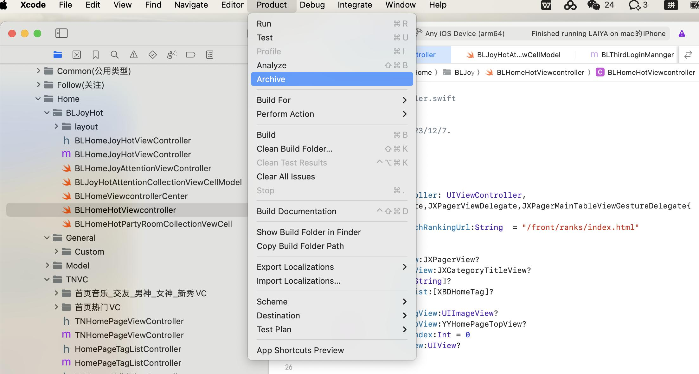
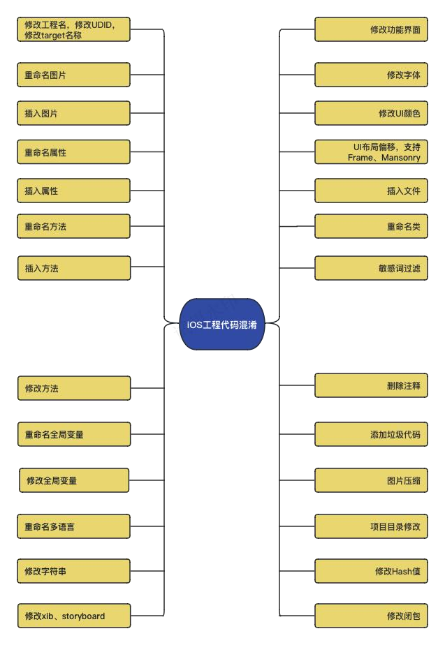

> **iOS** **APP** **上架** **和** **马甲** **AB** **包**
>
> **一、iOS** **APP** **上架整体流程**
>
> **1.1** **iOS** **App** **上架整体流程图如下**
>
> **1.2** **申请开发者账号**
>
> **申请账号的设备** **Mac** **或** **iPhone**
> **尽量用比较干净的设备申请**
>
> 个人账号：个人申请用于开发 Apple App 所使用的账号仅限于
>
> 个人使用，可以在 App Store 发布应用，申请比较容易，
>
> ￥688.00/年 (\$99.00/year)。

> 公司账号：以公司名义申请的开发者账号，用于公司内部的开发
>
> 者共用，可以在 App Store 发布应用，申请流程相对麻烦，
>
> ￥688.00/年 (\$99.00/year)。
>
> 企业账号：一般是公司规模在 500 人以上的企业，用于内部测
>
> 试、分发应用的账号，不能在 App Store 发布应用，申请流程相
>
> 对麻烦，￥1988/(\$299.00/year)。
>
> **不同开发者账号步骤与所需资料**
>
> **1.3** **App** **Store** **类型证书**
>
> App Store 证书只能用于发布应用到 AppStore，不能安装在非越狱

> 设备上面。如图，点击左侧菜单 Certificates，然后**点击添加按钮**
>
> 选择 **iOS** **Distribution** **(App** **Store** **and** **Ad**
> **Hoc)**，**点击** **Continue**
>
> **返回击左侧菜单Certificates,** **Identifiers** **&** **Profiles**
> **点击Profiles，**
>
> **然后点击添加按钮**
>
> 选择 App store

> **点击下一步，选择自己的** **App** **ID：**
>
> **点击下一步，选择发布的** **Distribution:**
>
> **continue** **下一步** **生成发布的证书**

> **1.4** **AppStore** **Connect** **创建** **App**
>
> **打开** **App** **Store** **Connect** **，点击加号创建** **App**
>
> **1.5** **打包上传到** **App** **Store**

> 苹果审核标准共分为五大类:安全、性能、业务、设计及法律，我们
>
> 要严格按照审核标准来开发和提交我们的 APP。当然，在提审之前
>
> 还有一些准备工作需要确保完成好：
>
> **要确保** **APP** **没有明显的崩溃和错误。**
>
> 确保 APP 的可用性和完整性,不能是演示 APP 或 demo。
>
> APP 所有预览图、简介、关键词等都要是和产品业务相关的。
>
> 更新您的联系信息，以便 App Review 部门在需要时与您取得联
>
> 系
>
> 提供有效的演示帐户和登录信息，以及审核所需要的资源。
>
> APP 启用后台服务，确保其在审核期间处于活动和可用状态
>
> 相关权限要说明其用用途，如果是壳上架或混淆代码，就更需要
>
> 注意
>
> **二、A** **包和** **B** **包**
>
> **2.1** **马甲包**
>
> **2.1.1** **马甲包的定义**
>
> 马甲包一般是主 APP 的分身或者克隆，也或者说是穿着马甲的一个
>
> APP，脱掉马甲， PP 将呈现另一种样式，也就是常说的 AB 面 APP。
>
> **马甲包的作用：**
>
> 1.抢占更多的 App Store 的位置。
>
> 2.防止主 APP 下架，做替补。
>
> 3.测试功能，运营等，减少对主 APP 的下架概率。
>
> 4.避开 30%分成，支付切换
>
> 5.为主 APP 引流，获取更多的资源
>
> 6.增加更多的关键字，打压同类型竞争对手
>
> **2.1.2** **马甲包制作注意事项**
>
> 二进制不同 应用名称，图标，包名，工程名，打包电脑，代码，
>
> 静态资源等的修改。
>
> 差异化 整体 UI，产品功能，页面布局等的修改
>
> **2.1.3** **AB** **面** **APP** **类型的马甲包**

> 这种类型的 APP 一般是在审核的时候，**把** **A** **面呈现给** **apple**
> **的审核**
>
> **人员，审核结束以后再把** **B**
> **面呈现给用户**；这种一般是为了规避苹果
>
> 严格苛刻的审核限制而出现的一种产业；这种的应用很常见，不论是
>
> 小作坊 APP 还是大厂的 APP，基本上都会搞；比如为了规避苹果的
>
> 30% 的抽成支付，在审核的时候隐藏虚拟充值入口，上线成功以后
>
> 再开发充值入口，等等；
>
> **2.1.4** **马甲包的审核风险（Apple** **审核** **4.3）**
>
> Apple **审核大体分为三部分，预审、机审和人工审核。包上传后首先**
>
> **进入的是预审，会被扫描** **API** **等，没问题的话才会在** **iTC**
> **里出现，**
>
> **然后才可以提交至** **Waiting。**在审核前期，也就是 Waiting For
>
> Review（等待审核）阶段一般是机审。机审不通过则直接被拒，通
>
> 过后会进入人工审核，即 In Review（审核）阶段，这个阶段主要看
>
> 的是 App 的元数据，例如标题、描述、截图等，以及检测 App 的功
>
> 能使用情况，常遇到的 ipv6 也在此处检测。
>
> 4.3 是功能或者应用程序重复出现在 App Store，包括相同类型产品
>
> 功能较一致，以及上传马甲或者分包导致的被拒回复，以下方案希望
>
> 能帮到大家处理此类问题！
>
> **三、马甲包同质化被拒解决方案**
>
> **3.1** **非代码工程改造的注意事项**
>
> 开发者帐号：两个马甲包不要关联到同一个开发者帐号的信息；
>
> 比如打包时关联。
>
> 打包电脑：有条件的最好用不同的 MAC 来打包（每台 MAC 上最
>
> 好打包马甲包不要超过 5 个）
>
> 上传 IP：上传马甲包时，IP 不要跟其他马甲包的 IP 相同；
>
> 材料相似：App Store Connect 后台材料如宣传图，ICON，版权
>
> 人不要出现相同；
>
> 改 App 名字；
>
> 修改素材及 UI 色调等，例如修改 icon，修改主色调；
>
> 修改功能界面等，可改功能可做小开关；
>
> **3.2** **代码工程混淆改造**
>
> **3.2.1** **现有工具代码混淆**
>
> **Confuse**（https://github.com/520coding/confuse）是一款[混](https://cloud.tencent.com/developer/tools/blog-entry?target=https://github.com/520coding/confuse&source=article&objectId=1845220)
>
> 淆工具，尽可能模拟人工开发，仿照 Xcode 部分功能，避免机核
>
> 4.3、2.1、2.3.1、账号调查等。
>
> 目标：模拟人工修改一切能改的地方，这也是为什么本工具只有
>
> 黑名单没有白名单的原因。
>
> **ZFJObsLib(https://github.com/zfjsyqk/ZFJObsLib?tab=read**
>
> **me-ov-file)** **ZFJ** **代码混淆软件**
>
> **混淆相关：**
>
> 1、代码方面：属性混淆、类名混淆、函数混淆、方法混淆、垃圾代
>
> 码、加密字符串、删除注释、关键词混淆、Xib/Storyboard 控件 id
>
> 混淆
>
> 2、资源方面：修改资源名、修改资源 HASH 值、图片混淆（指定 16
>
> 进制改色、颜色替换、全部改色）
>
> 3、项目配置：修改项目名、混淆目录、UUID 混淆
>
> 4、其他混淆：敏感词过滤、控件颜色魔改、字体颜色魔改
>
> **3.2.2** **工程代码混淆改造**
>
> **工程代码改造项如下图所示：**

> **3.3** **工程代码重写**
>
> 如果上面的代码混淆的方案行不通，那我们只能重写项目工程，大体
>
> 如下：
>
> 重构工程项目底层框架
>
> 重写业务层代码
>
> UI 功能界面翻新
>
> 美术资源界面换成新的一套等等
>
> **四、结束**
>
> 后完待续
